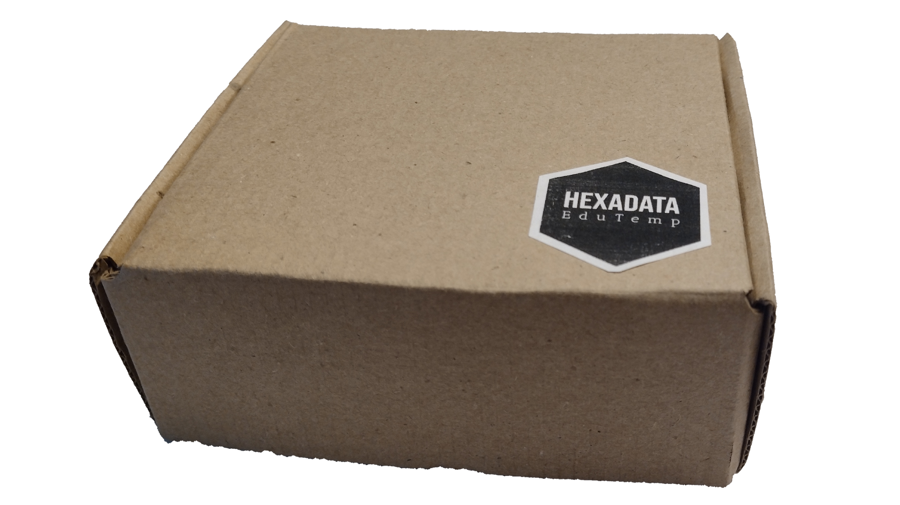

+++
date = "2023-07-01 05:20:35"
draft = false
title = "Termómetro Educativo EduTemp"
description = "Sensor de temperatura educativo inteligente Wi-Fi"

[taxonomies]
tags = ["edutemp", "sensor-temperatura"]

[extra]
image = 'projects/edutemp/ecommerce_up_final.jpg'
+++

Hexadata EduTemp es un termómetro inteligente especialmente pensado para el ámbito educativo. El rango de operación del dispositivo está comprendido entre los -55 y los 120 grados Celsius. No necesita conexión a Internet para funcionar, no es necesario instalar ninguna aplicación adicional en el celular y lo pueden usar varias personas al mismo tiempo. La documentación (impresa y digital) e interfaz gráfica del dispositivo están totalmente en Español.

> Nota: NO se recomienda la utilización de este instrumento fuera del ámbito educativo u hogareño.

Sólo requiere alimentación por USB para funcionar. Bien a través de un cargador de celular cualquiera, un puerto USB de una notebook o hasta de un powerbank (batería portable).

La medición de temperatura se realiza por medio de un sensor con punta de acero inoxidable, sumergible y resistente a cualquier tipo de líquido no corrosivo. Esta punta se conectan al dispositivo a través de un cable tripolar tipo taller de 4 mm.

La información del dispositivo se visualiza a través del navegador web (Google Chrome u otro). Para esto, el dispositivo "levanta" una wifi de nombre "EduTemp". Esta wifi es abierta y no requiere contraseña para conectarse. Se puede conectar al dispositivo desde cualquier celular con wifi, una notebook, tablet, etc. El dispositivo permite tener hasta 8 dispositivos conectados a él al mismo tiempo.

Una vez conectado al dispositivo, cada usuario debe abrir el Google Chrome e ingresar a la página del dispositivo (todas estas instrucciones están documentadas en el manual de usuario que viene impreso junto al dispositivo). Al ingresar, cada usuario podrá visualizar:

- La temperatura sensada en tiempo real (se actualiza cada 1 segundo), en grados Celsius y en grados Farenheit.
- La cantidad de usuarios conectados al dispositivo, en tiempo real.
- El estado de conexión que cada usuario tiene contra el dispositivo. (Permite detectar si el navegador del usuario se desconectó o perdió la conexión al termómetro, por alguna razón).
- Un gráfico interactivo de temperatura en función del tiempo, con varios controles para controlarlo de forma independiente de cada usuario (lo que un usuario hace, no afecta a la visualización ni datos de los demás usuarios conectados).

Adicionalmente a esto, la interfaz del termómetro posee la siguiente información:

- Posee fórmula coeficiente de dilatación lineal y tabla con valores de los materiales más comunes.
- Posee fórmula coeficiente de dilatación superficial y tabla con valores de los materiales más comunes.
- Posee fórmula coeficiente de dilatación volumétrica y tabla con valores de los materiales más comunes.

Esta información permite realizar ciertas actividades prácticas en el laboratorio y/o aula de forma más fácil y práctica, y que los estudiantes tienen la información en la misma pantalla.