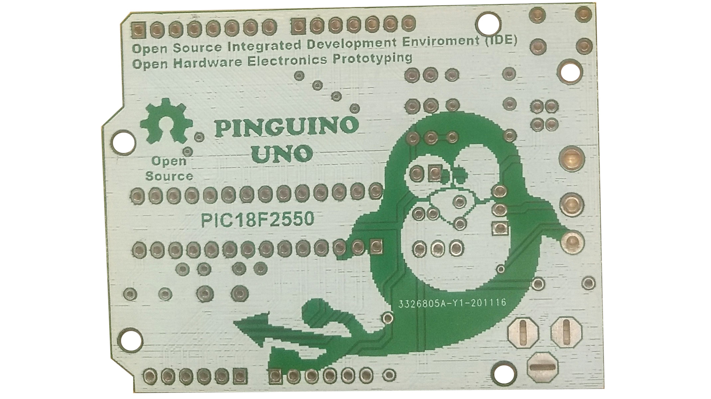

+++
date = "2021-04-30 05:20:35"
draft = false
title = "Pinguino Uno PCB"
description = "Placa entrenadora / educativa para PIC18F2550"

[taxonomies]
tags = ["pinguino", "open-hardware"]

[extra]
image = 'projects/pinguino-uno-pcb/ecommerce-pinguino-front.png'
+++

[Comprar en MercadoLibre](https://articulo.mercadolibre.com.ar/MLA-1493595856-pinguino-uno-placa-entrenadora-pic-_JM)

Pinguino Uno es una placa especialmente pensada para el ámbito educativo, hogareño y hobbista. Originalmente diseñada para ser utilizada con el [Proyecto Pinguino](https://pinguinoide.github.io/), aunque puede usarse de forma independiente también.

## Es Sencilla

Se compone de pocos componentes electrónicos y éstos no son superficiales (no SMD), por lo que es sencillo armarla, aún para personas con poca experiencia en electrónica.

## Es OpenHardware

Tanto su documentación, diagrama esquemático, diseño PCB y sus archivos Gerber, son libres y abiertos. Es decir que el usuario cuenta con toda la información necesaria para estudiar, comprender, armar y hasta modificar la placa de forma totalmente autónoma. Sin depender de su fabricante.

## Características técnicas

* Puerto USB tipo D.
* 17 pines digitales / 5 pines analógicos / 2 pines PWM.
* Bornera de conexión y Jack pin fino para fuente de alimentación externa.
* Estabilizador de voltaje integrado. Puede ser energizada por cable USB o Fuente externa 9-12V.
* Mismas dimensiones del Arduino UNO.
* Mismas distribución de pines digitales y analógicos del Arduino UNO.
* Luces LED indicadores de encendido, y otro para uso específico por parte del usuario.

**Nota: La placa PCB publicada se vende sola. No incluye ningún componente electrónico.**

Está fabricada en material sustrato FR-4 color verde de 1.6mm de espesor y 2 capas de cobre de 1Oz de espesor cada una. La superficie de la placa posee terminación HASL. El factor de forma de la placa se corresponde con el de Arduino Uno, por lo que todos los shields calzarán correctamente en ella.

## Reconocimiento

Esta placa es desarrollo de [PCB Designer](https://thepcbdesigner.blogspot.com/2020/01/pinguino-uno.html).